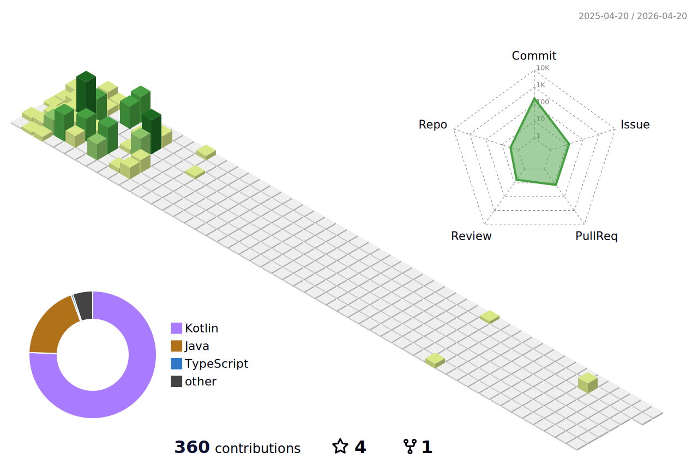

  

<h3 align="center"> Tech Stack </h3>

  </a>
  </a>
  </a>
  </a>
   
  </a>
  </a>
  </a>
   
  </a>
  </a>
  </a>
   
  </a>
  </a>
  

  
  <h3 align="center"> Tools </h3>
  

    
  </a>
  </a>
  </a>
  </a>
  </a>
    

 
  
  ### Experience

| 회사 명 |  재직 상태  | 담당 직무 | 근속 기간 | 담당 업무 |
| ------ | -------------------- | ---------------- | -------- | -------- |
| [CUPIST (Team DotDotDot)](https://www.cupist.com) |  재직 중  | Backend Engineer | 2025.07 ~ | Prompt Engineering / LLM Evaluator System / FastAPI / PostgreSQL / AWS 서버 개발 및 운영 |

  ### Certificates

| 자격증 명                                                                               | 등급                | 취득 일자      | 유효 기간                   |
| ----------------------------------------------------------------------------------- | ----------------- | ---------- |-------------------------|
| [제56회 SQL 개발자(SQLD)]() | -                 | 2025.04.04 | 2025.04.04 ~ 2027.04.04 |

<!-- 3D 잔디 -->
    

